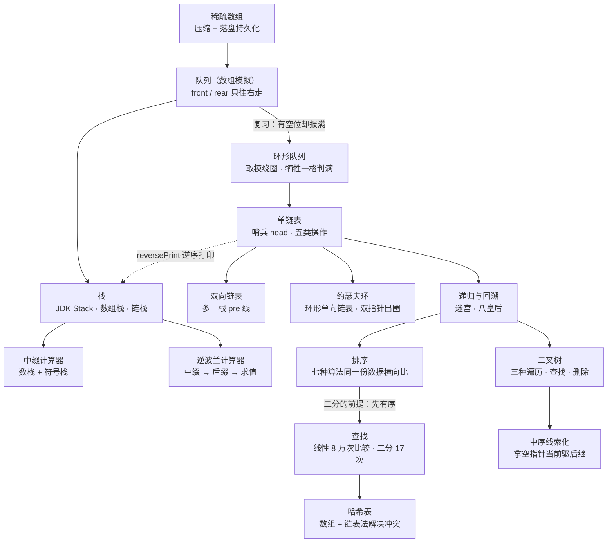

# 数据结构与算法 · Java 手写实现与笔记

用 Java 从零手写常见数据结构：每个知识点一份可运行的 `.java` 实现 + 一份 `.md` 笔记。笔记里不抄定义，而是把「这个实现为什么这么写、指针怎么动、代价在哪、踩过什么坑」讲清楚，结论基本都实跑过一遍。

包名 `com.ittxf`，源码在 `src/`，笔记与程序放在同一个目录下。

## 学习路线



## 知识点清单

| 板块 | 程序 | 笔记 | 核心点 |
| --- | --- | --- | --- |
| 稀疏数组 | `sparseArray.java` | [稀疏数组.md](src/com/ittxf/sparsearray/稀疏数组.md) | 二维数组 ↔ 稀疏数组互转，顺带把稀疏数组写进磁盘文件再读回来（数据结构 + 文件 IO 一起练）；第 0 行为什么必须有 |
| 队列（数组） | `ArrayQueueDemo.java` | [队列.md](src/com/ittxf/queue/队列.md) | `front`/`rear` 只右移不回绕，导致「数组还有空位却报满」；出队抛异常、入队打提示的分工 |
| 环形队列 | `CircleArrayQueueDemo.java` | [环形队列.md](src/com/ittxf/queue/环形队列.md) | `(rear + 1) % maxSize` 绕圈；判满为什么要牺牲一格；元素个数公式里 `+ maxSize` 的作用 |
| 栈（JDK 现成） | `TestStack.java` | [栈.md](src/com/ittxf/linkedlist/栈.md) | `java.util.Stack` 继承 `Vector` 是个「漏」的抽象——能从任意位置删元素；为什么生产代码用 `ArrayDeque` |
| 数组栈 | `ArrayStackDemo.java` | [数组栈.md](src/com/ittxf/stack/数组栈.md) | `push` 必须 `++top`、`pop` 必须 `top--`；和数组队列长得像，差别在「一根指针 vs 两根指针」，也因此天生没有假满 |
| 链栈 | `LinkedStackDemo.java` | [链栈.md](src/com/ittxf/stack/链栈.md) | 把栈顶对准链表头部；`node.next = top; top = node;` 两句顺序是铁律；`count` 字段是工程取舍 |
| 中缀表达式计算 | `Calculator.java` | [双栈计算器.md](src/com/ittxf/stack/双栈计算器.md) | 数栈 + 符号栈边扫边算；`priority('(') = -1` 为什么就能挡住括号外的结算；多位数 lookahead 只能判“还是数字”不能判“不是运算符”（否则 `)` 被拼进数字里抛 `NumberFormatException`） |
| 逆波兰 | `PolandNotation.java`、`ReversePolishCalculator.java` | [逆波兰计算器.md](src/com/ittxf/stack/逆波兰计算器.md) | 分词 → 调度场算法转后缀 → 单栈求值；后缀式为何不需要优先级和括号；两份实现的差异对照表（小数/空白/括号校验/除零） |
| 单链表 | `SingleLinkedListDemo.java` | [单链表.md](src/com/ittxf/linkedlist/单链表.md) | 哨兵 head；五种操作的差别全在「temp 从哪起步、跟谁比较」；头插法反转、借栈逆序打印、归并 merge；`getLength` 混入副作用与 `findLastIndexNode` 的两次遍历都单独拎出来复盘 |
| 双向链表 | `DoubleLinkedListDemo.java` | [双向链表.md](src/com/ittxf/linkedlist/双向链表.md) | 多一根 `pre`，删除从「必须找前驱」变成「自己摘自己」；笔记第四节是一个实测确认的插入 bug（插到中间时后继的 `pre` 没回连） |
| 约瑟夫环 | `Josepfu.java` | [约瑟夫环.md](src/com/ittxf/linkedlist/约瑟夫环.md) | 环形单向链表；`showBoy` 的终止条件是「绕回来」不是「遇到 null」；`countBoy` 双指针报数出圈 |
| 排序 | `BubbleSort.java`、`SelectSort.java`、`InsertSort.java`、`ShellSort.java`、`QuickSort.java`、`MergeSort.java`、`RadixSort.java` | [排序.md](src/com/ittxf/sort/排序.md) | 七种排序在**同一份数据**（固定种子）上实测：冒泡 7162ms / 选择 1121ms / 插入 705ms / 希尔移动法 7ms / 快排 8ms / 归并 6.3ms / 基数 2.1ms —— 同为 O(n²) 常数差 10 倍，同一个希尔换个内层写法差 430 倍，基数因为一次都不比大小而绕开 O(n log n) 下界；归并那节实测「合并次数永远是 n-1」（8 万 → 79999 次）与 temp 写入 1,308,928 次；还标出了原 `main` 里“七个程序各跑各的随机数”为何不可比 |
| 查找 | `SeqSearch.java`、`BinarySearch.java`、`InsertValueSearch.java`、`FibonacciSearch.java` | [搜索算法.md](src/com/ittxf/search/搜索算法.md) | 8 万数据实测比较次数：线性 80000 次 vs 二分 17 次；连查 1000 次是 6.5ms vs 0.12ms，所以「只查一两次不如线性」；二分**不检查数组有没有序**（实测无序数组 6 个值里 3 个报「不存在」，`Arrays.binarySearch` 返回逐个相同）；`mid ± 1` 少一个就 `StackOverflowError`；插值在等差数据上实测一次命中（二分要 12~15 次），但数据不均匀要 101 次、数组全相同会除零、10 万个数据找 50000 会因乘法溢出爆栈；斐波那契的 `maxSize = 20` 就是 4181 的硬上限（8 万数据实测 AIOOBE） |
| 二叉树 | `BinaryTreeDemo.java`、`ArrBinaryTreeDemo.java`、`Test.java` | [二叉树.md](src/com/ittxf/tree/二叉树.md) | 同一棵树实测前序 `1 2 4 5 3` / 中序 `4 2 5 1 3` / 后序 `4 5 2 3 1`；找同一个 5 号，前序比 4 个节点、中序 3 个、后序 2 个（与代码注释一致）；`deleteNode` 会把整棵子树带走，`deleteNodeAdvanced` 那句「防止丢失」的挂接实测吃掉了左孩子原本的右子树；顺序存储用 `2i+1`/`2i+2` 当下标指针，且判空那段少了 `return` |
| 中序线索化 | `ThreadedBinaryTreeDemo.java` | [线索二叉树.md](src/com/ittxf/tree/线索二叉树.md) | 7 个节点 14 个指针域里 6 个填成真线索，实测顺线索走一圈 `4 2 5 1 6 3 7` 只要 O(1) 空间；两个实测代价 —— 线索化之后 `inOrder()`/`preOrder()`/`deleteNode()` 会顺线索绕回祖先爆栈，`preNode` 没复位导致跑第二遍把首尾接成一个环 |
| 哈希表 | `HashTableDemo.java` | [哈希表.md](src/com/ittxf/hashtable/哈希表.md) | 数组 + 链表法：`id % size` 挑桶、桶里线性扫；实测 10 个人进 5 个桶每条链 2 人，桶数就是代价分摊的份数（写死 5、没有 rehash）；负 id 实测 `AIOOBE`（Java 的 `%` 跟被除数同号），「id 自增」只是注释里的假设，先 15 后 10 桶内就是插入顺序 |
| 递归 | `RecursionTest.java` | [递归.md](src/com/ittxf/recursion/递归.md) | 栈帧视角看 `test(5)` 为何输出 `2 3 4 5`；`println` 放递归前还是后，顺序正好相反；`StackOverflowError` 与 `int` 溢出是两条不同的红线 |
| 迷宫 | `MazeProblem.java`、`MazeShortestPath.java` | [迷宫与回溯.md](src/com/ittxf/recursion/迷宫与回溯.md) | 同一张地图、同一种约定，**只差“回溯时把格子擦回 0”这一行**：前者找一条通路，后者穷举 9028 条取最短（实测最短 9 步、最长 27 步）；`map.clone()` 浅拷贝会改碎快照 |
| 八皇后 | `Queen8.java` | [八皇后.md](src/com/ittxf/recursion/八皇后.md) | `array[行] = 列` 的一维建模；`judge` 两个条件（同列 / 行距==列距）；为什么这里**不写撤销语句**也算回溯；实测 92 解 / 15720 次判断，只判同列会变成 40320 = 8! |

两个配套动画（浏览器双击打开即可，纯离线、零外部依赖）：

- [单链表反转动画.html](src/com/ittxf/linkedlist/单链表反转动画.html) —— 头插法 / 三指针两种算法逐帧看，代码行高亮 + 指针变量表同步跳动，还带两个“错误写法”反面教材。
- [八皇后动画.html](src/com/ittxf/recursion/八皇后动画.html) —— 棋盘 + Java 代码行高亮（行号与 `Queen8.java` 一致）+ 递归调用栈 + 冲突高亮同步动；4/6/8 棋盘可切，单步/回退/拖进度/跳下一个解。

另有一个手写的指针变化过程：[单链表反转.txt](src/com/ittxf/linkedlist/单链表反转.txt)。

## 目录结构

```text
src/com/ittxf/
├── sparsearray/   sparseArray.java        + 稀疏数组.md
├── queue/         ArrayQueueDemo.java     + 队列.md
│                  CircleArrayQueueDemo.java + 环形队列.md
├── stack/         ArrayStackDemo.java     + 数组栈.md
│                  LinkedStackDemo.java    + 链栈.md
│                  Calculator.java         + 双栈计算器.md
│                  PolandNotation.java     ┐
│                  ReversePolishCalculator.java ┴ 逆波兰计算器.md
├── linkedlist/    SingleLinkedListDemo.java + 单链表.md + 反转动画.html + 反转.txt
│                  DoubleLinkedListDemo.java + 双向链表.md
│                  Josepfu.java            + 约瑟夫环.md
│                  TestStack.java          + 栈.md
├── sort/          BubbleSort.java         ┐
│                  SelectSort.java          │
│                  InsertSort.java          ├ 排序.md
│                  ShellSort.java           │
│                  QuickSort.java           │
│                  MergeSort.java           │
│                  RadixSort.java          ┘
├── search/        SeqSearch.java          ┐
│                  BinarySearch.java        │ 搜索算法.md
│                  InsertValueSearch.java   │
│                  FibonacciSearch.java    ┘
├── tree/          BinaryTreeDemo.java     ┐
│                  ArrBinaryTreeDemo.java   ├ 二叉树.md
│                  Test.java               ┘
│                  ThreadedBinaryTreeDemo.java + 线索二叉树.md
├── hashtable/     HashTableDemo.java      + 哈希表.md
└── recursion/     RecursionTest.java      + 递归.md
                   MazeProblem.java       ┐
                   MazeShortestPath.java  ┴ 迷宫与回溯.md
                   Queen8.java            + 八皇后.md + 八皇后动画.html
```

## 怎么跑

32 个 `.java` 都带 `main`，IDEA 里直接点绿色三角即可。命令行（PowerShell 用 `;` 分隔，不能用 `&&`）：

```powershell
# 单个程序：编译 + 运行
javac -encoding UTF-8 -d out src\com\ittxf\queue\ArrayQueueDemo.java
java -cp out com.ittxf.queue.ArrayQueueDemo

# 整个 src 一次编译（本机 JDK 21，32 个文件全部通过）
javac -encoding UTF-8 -d out (Get-ChildItem -Recurse src -Filter *.java).FullName
```

几点注意：

- 队列、栈、链表那几个 `*Demo` 跑起来是命令行菜单，靠敲 `s`/`a`/`g`/`l`/`h` 之类的字母选操作，不是自动输出结果。
- `sort` 包下每个程序的 `main` 会自己生成 80000 个随机数并打印耗时；想拿七种算法做可信对比，得用同一份数据（[排序.md](src/com/ittxf/sort/排序.md) 第十节给了做法）。
- `search` 包下四个程序的 `main` 都是固定的一小段数组，跑起来只打印一个下标；要做第十节那张「排一次序 vs 扫一千次」的账，得自己造 8 万个数据。
- `tree` 包下三个 `*Demo` 会把整棵树的遍历结果打满屏，`Test.java` 跑起来什么都不打印（只有 `ArrayList` 扩容的注释）。
- `hashtable` 包下是命令行菜单（`add`/`list`/`find`/`exit`），也可以整串输入用管道喂给标准输入，见 哈希表.md 第六节。
- `Calculator` 和 `ReversePolishCalculator` 可以传表达式：`java -cp out com.ittxf.stack.Calculator "(3+2)*4-1"`。
- `sparseArray.java` 会在**运行时工作目录**下生成 `filePath/map.data`（相对路径，IDEA 默认就是项目根）。这是跑出来的产物，已在 `.gitignore` 里忽略；`out/`、`.idea/`、`*.iml` 同样不入库。
