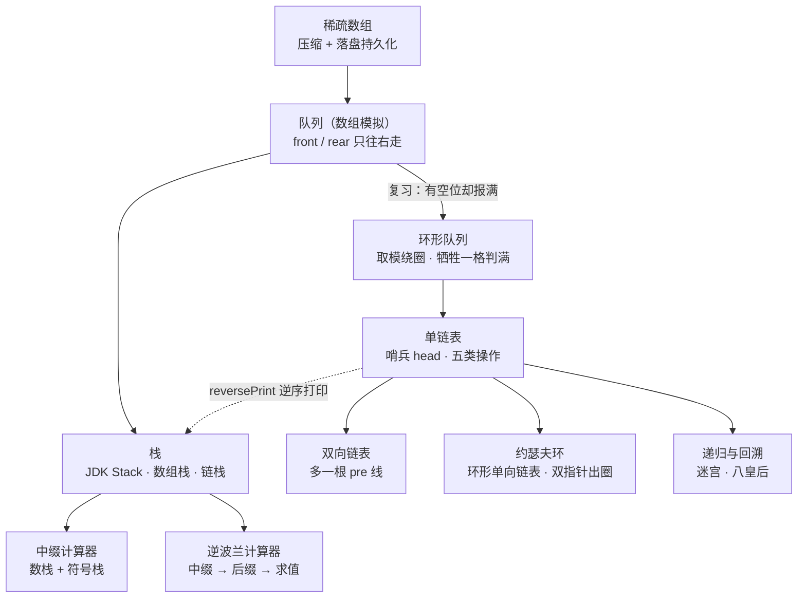

# 数据结构与算法 · Java 手写实现与笔记

用 Java 从零手写常见数据结构：每个知识点一份可运行的 `.java` 实现 + 一份 `.md` 笔记。笔记里不抄定义，而是把「这个实现为什么这么写、指针怎么动、代价在哪、踩过什么坑」讲清楚，结论基本都实跑过一遍。

包名 `com.ittxf`，源码在 `src/`，笔记与程序放在同一个目录下。

## 学习路线



## 知识点清单

| 板块 | 程序 | 笔记 | 核心点 |
| --- | --- | --- | --- |
| 稀疏数组 | `sparseArray.java` | [稀疏数组.md](src/com/ittxf/sparsearray/稀疏数组.md) | 二维数组 ↔ 稀疏数组互转，顺带把稀疏数组写进磁盘文件再读回来（数据结构 + 文件 IO 一起练）；第 0 行为什么必须有 |
| 队列（数组） | `ArrayQueueDemo.java` | [队列.md](src/com/ittxf/queue/队列.md) | `front`/`rear` 只右移不回绕，导致「数组还有空位却报满」；出队抛异常、入队打提示的分工 |
| 环形队列 | `CircleArrayQueueDemo.java` | [环形队列.md](src/com/ittxf/queue/环形队列.md) | `(rear + 1) % maxSize` 绕圈；判满为什么要牺牲一格；元素个数公式里 `+ maxSize` 的作用 |
| 栈（JDK 现成） | `TestStack.java` | [栈.md](src/com/ittxf/linkedlist/栈.md) | `java.util.Stack` 继承 `Vector` 是个「漏」的抽象——能从任意位置删元素；为什么生产代码用 `ArrayDeque` |
| 数组栈 | `ArrayStackDemo.java` | [数组栈.md](src/com/ittxf/stack/数组栈.md) | `push` 必须 `++top`、`pop` 必须 `top--`；和数组队列长得像，差别在「一根指针 vs 两根指针」，也因此天生没有假满 |
| 链栈 | `LinkedStackDemo.java` | [链栈.md](src/com/ittxf/stack/链栈.md) | 把栈顶对准链表头部；`node.next = top; top = node;` 两句顺序是铁律；`count` 字段是工程取舍 |
| 中缀表达式计算 | `Calculator.java` | 笔记待补（代码内注释较全） | 数栈 + 符号栈边扫边算，支持多位数、括号，并用括号深度校验配对；可 `args[0]` 传表达式 |
| 逆波兰 | `PolandNotation.java`、`ReversePolishCalculator.java` | 笔记待补 | 前者只算给定的后缀表达式；后者走完整三步（中缀→中缀 List→后缀 List→求值），支持小数、过滤各类空白，main 里带一组用例自测 |
| 单链表 | `SingleLinkedListDemo.java` | [单链表.md](src/com/ittxf/linkedlist/单链表.md) | 哨兵 head；五种操作的差别全在「temp 从哪起步、跟谁比较」；头插法反转、借栈逆序打印、归并 merge；`getLength` 混入副作用与 `findLastIndexNode` 的两次遍历都单独拎出来复盘 |
| 双向链表 | `DoubleLinkedListDemo.java` | [双向链表.md](src/com/ittxf/linkedlist/双向链表.md) | 多一根 `pre`，删除从「必须找前驱」变成「自己摘自己」；笔记第四节是一个实测确认的插入 bug（插到中间时后继的 `pre` 没回连） |
| 约瑟夫环 | `Josepfu.java` | [约瑟夫环.md](src/com/ittxf/linkedlist/约瑟夫环.md) | 环形单向链表；`showBoy` 的终止条件是「绕回来」不是「遇到 null」；`countBoy` 双指针报数出圈 |
| 递归 | `RecursionTest.java`、`MazeProblem.java`、`MazeShortestPath.java` | 笔记待补 | 递归调用机制与栈帧；迷宫按「下→右→上→左」找到一条通路就收工；`MazeShortestPath` 把走过的格子回溯成 `0`，于是能穷举所有通路并比较步数 |
| 八皇后 | `Queen8.java` | 笔记待补 | 冲突检测 `judge`（同列 / 对角线）和 `print` 已写好，`place` 与 `main` 还是空的 |

单链表那一章另有两个配套文件：[单链表反转动画.html](src/com/ittxf/linkedlist/单链表反转动画.html)（浏览器打开，头插法 / 三指针每一步可逐帧看）和 [单链表反转.txt](src/com/ittxf/linkedlist/单链表反转.txt)（手写的指针变化过程）。

## 目录结构

```text
src/com/ittxf/
├── sparsearray/   sparseArray.java        + 稀疏数组.md
├── queue/         ArrayQueueDemo.java     + 队列.md
│                  CircleArrayQueueDemo.java + 环形队列.md
├── stack/         ArrayStackDemo.java     + 数组栈.md
│                  LinkedStackDemo.java    + 链栈.md
│                  Calculator.java / PolandNotation.java / ReversePolishCalculator.java
├── linkedlist/    SingleLinkedListDemo.java + 单链表.md + 反转动画.html + 反转.txt
│                  DoubleLinkedListDemo.java + 双向链表.md
│                  Josepfu.java            + 约瑟夫环.md
│                  TestStack.java          + 栈.md
└── recursion/     RecursionTest.java / MazeProblem.java / MazeShortestPath.java / Queen8.java
```

## 怎么跑

16 个 `.java` 都带 `main`，IDEA 里直接点绿色三角即可。命令行（PowerShell 用 `;` 分隔，不能用 `&&`）：

```powershell
# 单个程序：编译 + 运行
javac -encoding UTF-8 -d out src\com\ittxf\queue\ArrayQueueDemo.java
java -cp out com.ittxf.queue.ArrayQueueDemo

# 整个 src 一次编译（本机 JDK 21，16 个文件全部通过）
javac -encoding UTF-8 -d out (Get-ChildItem -Recurse src -Filter *.java).FullName
```

几点注意：

- 队列、栈、链表那几个 `*Demo` 跑起来是命令行菜单，靠敲 `s`/`a`/`g`/`l`/`h` 之类的字母选操作，不是自动输出结果。
- `Calculator` 和 `ReversePolishCalculator` 可以传表达式：`java -cp out com.ittxf.stack.Calculator "(3+2)*4-1"`。
- `sparseArray.java` 会在**运行时工作目录**下生成 `filePath/map.data`（相对路径，IDEA 默认就是项目根）。这是跑出来的产物，已在 `.gitignore` 里忽略；`out/`、`.idea/`、`*.iml` 同样不入库。
